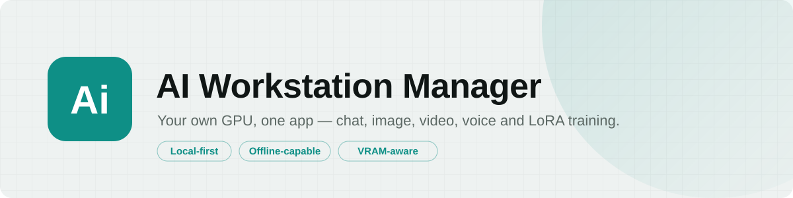
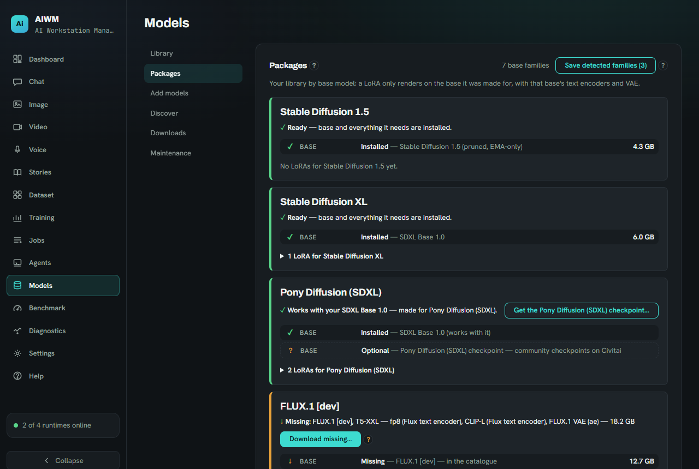
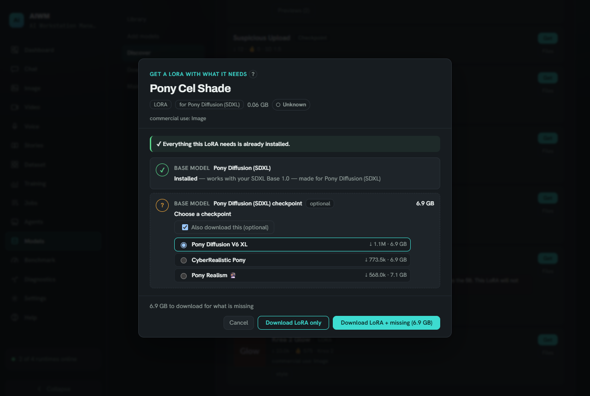
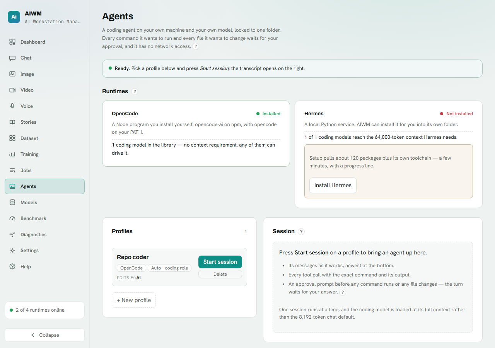
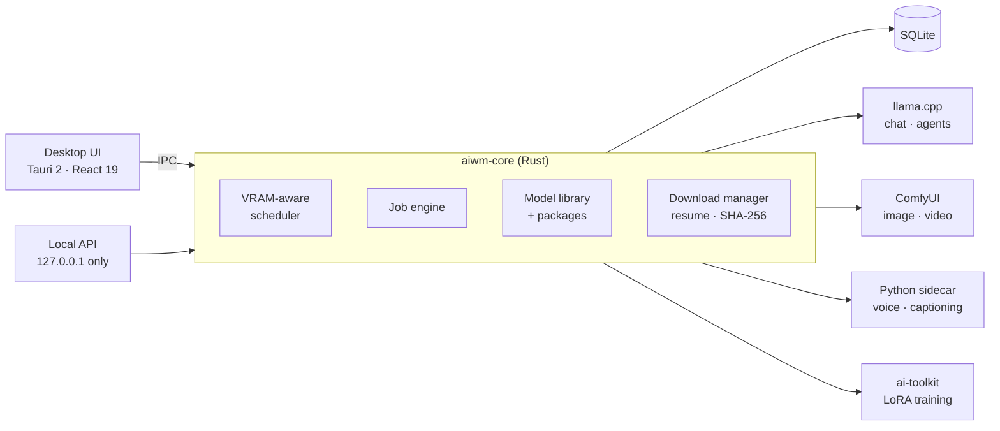

<p align="center">
  <picture>
    <source media="(prefers-color-scheme: dark)" srcset="docs/assets/banner-dark.svg">
    
  </picture>
</p>

<p align="center">
  <strong>One desktop app for everything your GPU can do with open models — chat, images, video, voice, datasets and LoRA training — running entirely on your own machine.</strong>
</p>

<p align="center">
  
  
  
  
</p>

---

AI Workstation Manager (**AIWM**) is a control room for local AI. It does not reinvent the
engines — it installs, supervises and schedules the best open runtimes (llama.cpp, ComfyUI,
ai-toolkit and friends), keeps one library of your models, and gives every capability a calm,
task-shaped interface. Once everything is installed it runs **fully offline**; the network is a
switch you turn on, never a requirement.

<p align="center">
  
</p>

## What you can do

| | |
|---|---|
| **Chat** | Local LLMs through llama.cpp, with personas, named sessions, side-by-side model comparison and `/image` / `/video` commands without leaving the conversation. |
| **Image** | FLUX.2 [klein], FLUX.1, SDXL and SD 1.5 through ComfyUI — a LoRA stack with a strength per LoRA, Hi-Res-Fix, reference images and edits, grouped into sessions with a gallery. |
| **Video** | Wan 2.2 TI2V-5B and LTX-Video: text-to-video and image-to-video from a start frame, with LoRAs. |
| **Voice** | Kokoro and Dia narration, including your own voice identities. |
| **Stories** | A story studio that keeps characters consistent across scenes. |
| **Datasets** | Drop in a folder of videos and pictures: frames are extracted, blurred frames and duplicates filtered, captions written by a local captioner (WD tagger, Florence-2, Qwen2.5-VL), then sorted on a Keep / Discard board with rubber-band selection and drag and drop. |
| **LoRA training** | Train your own LoRA with ai-toolkit — proven end to end on FLUX.2 [klein], with SDXL and Wan 2.2 profiles included — using presets, sample images while it trains, pause and resume; then keep improving the same LoRA on the next dataset with its full history kept. |
| **Models** | Search Hugging Face and Civitai (both front doors), see what fits your card before you download, and **Get** a model together with everything it needs — base, text encoder, VAE — in one step. |
| **Agents** | Coding agents (OpenCode, Hermes) on your own model, locked to one folder, with every command waiting for your approval. |
| **Benchmark** | Measure tokens per second, load time and VRAM per model on your hardware, and let the scheduler prefer what is actually fast. |

## Made for one workstation, done properly

- **It knows your VRAM.** A scheduler places, pins and evicts models against the real budget of
  your card — including what other programs on the GPU are using — so a render never collides
  with a loaded chat model.
- **Downloads you can trust.** One queue with resume; every file is re-hashed with SHA-256 after
  download and never trusted on the source's word; catalogue entries are pinned to exact
  revisions. API keys are sent only to the host they belong to.
- **Packages, not loose files.** A LoRA is worthless without its base model. AIWM knows which
  base every LoRA is made for, what you already have, what is still missing and what your
  hardware cannot run — before you download anything.
- **Your files are safe.** Cleanup only ever deletes what the app itself created, through tested
  safety checks: never models, never your source media, never anything a running job needs —
  always with a preview first.
- **You decide where data lives.** Put datasets and training runs on another drive; Settings shows
  every folder the app writes to with its size and free space.
- **Help where you need it.** Every non-obvious setting has an accessible `?` explaining what it
  does, why you would change it and what happens when you do — plus a searchable Help tab.

<table>
  <tr>
    <td width="50%"></td>
    <td width="50%"></td>
  </tr>
  <tr>
    <td align="center"><sub>Get a LoRA with everything it needs</sub></td>
    <td align="center"><sub>Coding agents on your own model, with approvals</sub></td>
  </tr>
</table>

## Measured on real hardware

Numbers from real runs on the reference machine (RTX 4080 SUPER 16 GB, 32 GB RAM,
Ryzen 7 7800X3D) — not estimates.

| What | Result |
|---|---|
| LoRA training, FLUX.2 [klein] 4B, *Fast* preset | 600 steps in 16 min 55 s (1.69 s/step), VRAM peak 12,340 of 16,376 MB |
| Continue an existing LoRA on a new dataset | 50 steps in 190.7 s, VRAM peak 11,915 MiB, source LoRA loaded with no missing keys |
| Dataset preparation from one video | 1,368 frames extracted and filtered in 298.6 s, 40 distinct frames kept |
| Cleanup of discarded frames | 1.16 GB freed in 0.28 s |

## How it works



The core is a single Rust process that owns state, scheduling and every runtime it starts. The
runtimes it supervises run under a Windows job object, so none of them is left behind when the app
closes; a training run is the deliberate exception — it is detached so it survives a restart and is
picked up again. The desktop UI and a loopback-only HTTP/WebSocket API talk to the same core.

## Getting started

AIWM targets **Windows 11** with an **NVIDIA GPU** (16 GB VRAM recommended for image, video and
training; chat works on less).

```powershell
# one-time setup: installs the toolchain (Node.js, Rust, uv, MSVC build tools),
# builds the core, UI and Python sidecar — safe to re-run
./scripts/install.ps1

# start the desktop app (or -Headless for the core and its local API only)
./scripts/start.ps1
```

Models are added from the **Models** tab — pick a curated package or search Hugging Face and
Civitai; the app downloads and verifies everything it needs. Full developer setup, build and
quality-gate instructions: [docs/DEV_SETUP.md](docs/DEV_SETUP.md).

## Project status

Private preview. All core capabilities above are built and in daily use on the reference machine;
every change goes through the same gate — formatting, lints, about 1,500 core tests and the UI
checks — before it lands, and the production code contains no `unsafe`.

- Roadmap and decisions: [docs/ROADMAP.md](docs/ROADMAP.md) · [docs/DECISIONS.md](docs/DECISIONS.md)
- Architecture: [docs/ARCHITECTURE.md](docs/ARCHITECTURE.md)
- Security model: [docs/SECURITY.md](docs/SECURITY.md)
- Full development log: [docs/DEVELOPMENT_LOG.md](docs/DEVELOPMENT_LOG.md)

## License

Private project, not licensed for commercial use (see ADR-011 in
[docs/DECISIONS.md](docs/DECISIONS.md)). Every model you download keeps its own licence, which
AIWM shows before the download.
